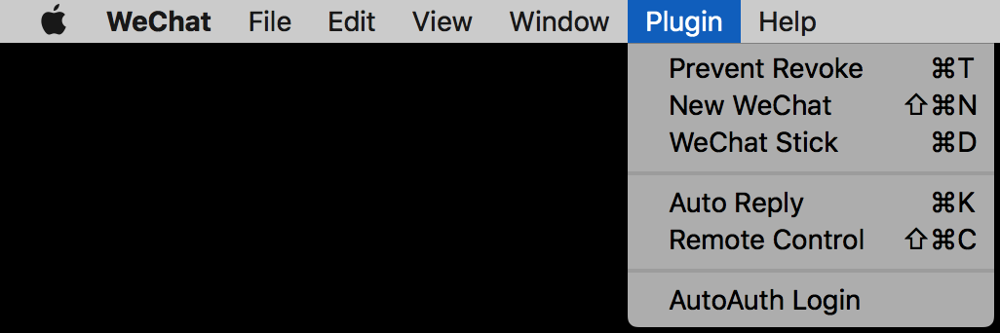

# WeChatPlugin-macOS

  

### 说明

* 包含功能: 自动回复、消息防撤回、远程控制、微信多开、会话置底、免认证登录、窗口置顶、会话多选删除、通知快捷回复、浏览朋友圈。
*  部分功能基于[WeChatPlugin-MacOS](https://github.com/TKkk-iOSer/WeChatPlugin-MacOS)开发，远程控制功能增强，配合[WeChatPlugin-iOS](https://github.com/CodeTips/WeChatPlugin-iOS)和越狱插件[WeChatPlugin](https://github.com/CodeTips/WeChatPlugin)可实现一键锁屏、关机等功能。菜单显示优化，本地化支持。原作者（**TK**）关键字去除，***个人强迫症***。
*  朋友圈功能基于[WeChatPlugin](https://github.com/Natoto/WeChatPlugin)开发，优化图片显示逻辑，修复刷新导致显示异常的问题。目前最新版微信已经不支持。
*  若使用中遇到遇到问题，请去以上提到的项目找解决方案，或者 **Issue me！**

### 依赖

* [XMLReader](https://github.com/amarcadet/XMLReader)
* [insert_dylib](https://github.com/Tyilo/insert_dylib)
* [fishhook](https://github.com/facebook/fishhook)

### 最后
* 使用愉快~
